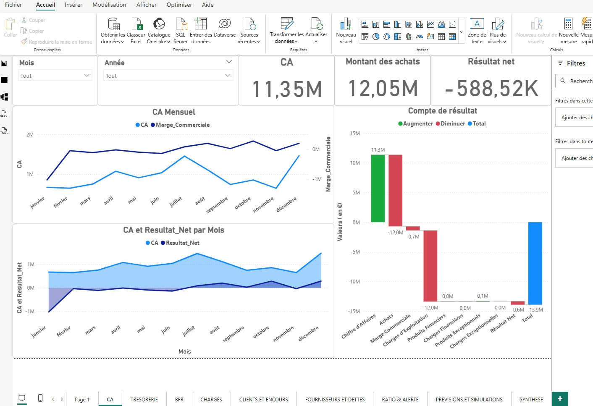
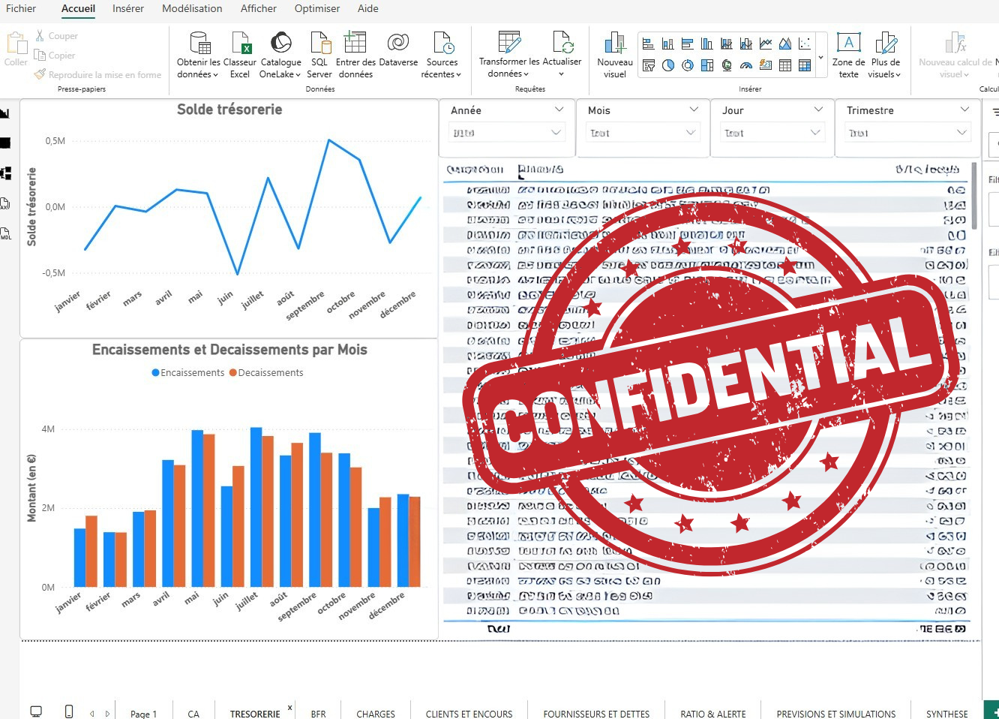
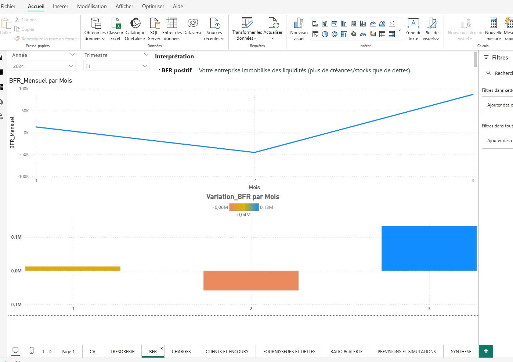
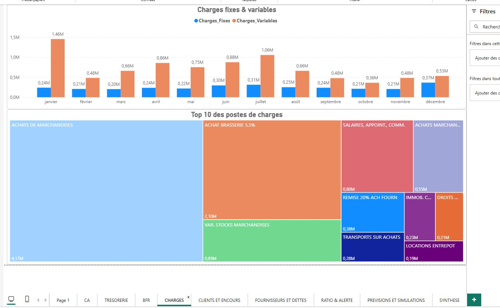
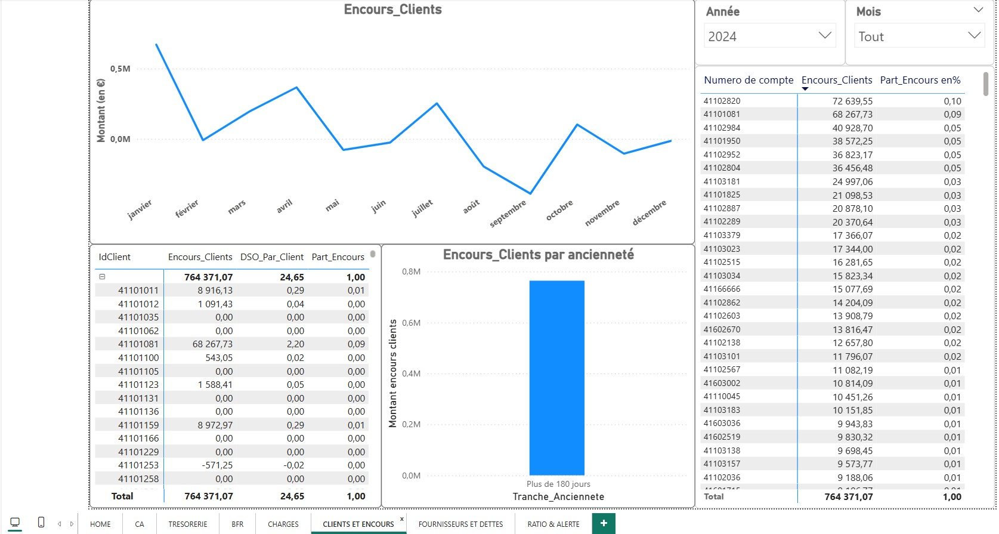
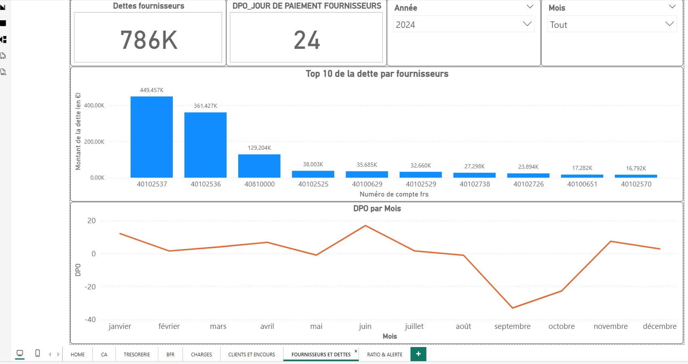
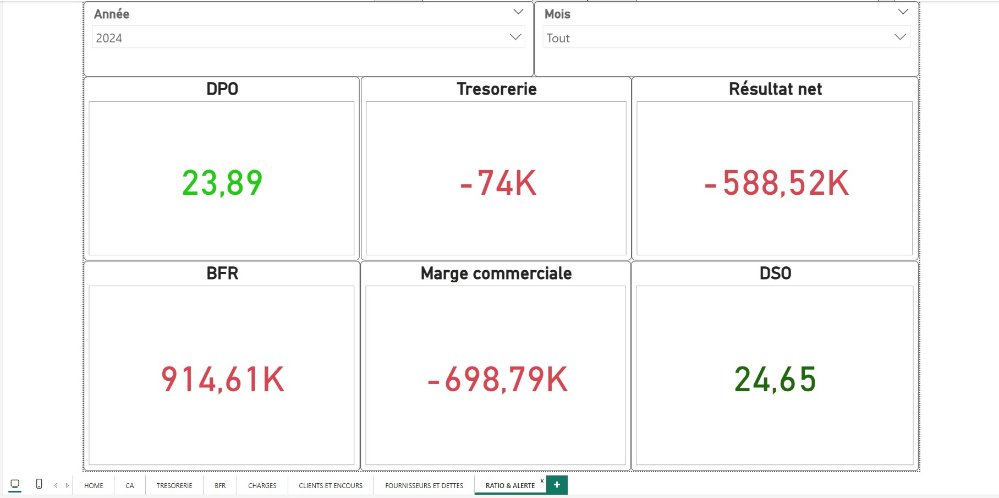

# 📊 Tableau de bord financier à partir d’un FEC comptable

Ce projet présente un **tableau de bord financier** construit à partir d’un **Fichier des Écritures Comptables (FEC)** avec Power BI. L’objectif est de transformer un FEC brut en outil de pilotage : activité, rentabilité, trésorerie, BFR, risques clients/fournisseurs et alertes.

> ⚠️ Par confidentialité, le fichier Power BI n’est pas publié. Le dépôt contient uniquement des **captures d’écran** du rapport.

---

## 🧾 Source de données : FEC

- Fichier des Écritures Comptables conforme à la norme française.  
- Table de faits `fec` (écritures) reliée à :
  - `Dates` (calendrier complet).  
  - `PCG` (plan comptable, regroupements P&L).  
  - Tables métiers (étapes de compte de résultat, paramètres, etc.).

---

## 🧠 Objectifs du tableau de bord

- Reconstituer un **compte de résultat** (CA, marge, résultat net).  
- Suivre la **trésorerie** et le **BFR** à partir du FEC.  
- Analyser les **encours clients** (DSO, ancienneté, top clients).  
- Analyser les **dettes fournisseurs** (DPO, top fournisseurs).  
- Mettre en place des **ratios & alertes** (codes couleur).

---

## 📸 Aperçu des pages du rapport

> Les images ci‑dessous sont stockées dans le dossier `Captures/`.

### 🏠 Page d’accueil

Page de présentation du tableau de bord financier.

---

### 📈 CA & Résultat

Suivi du chiffre d’affaires, de la marge commerciale et du résultat net (mensuel et annuel), avec visualisations dédiées.

---

### 💶 Trésorerie

Analyse du solde de trésorerie et des flux (encaissements / décaissements), avec masquage des données sensibles.

---

### 🔄 BFR (Besoin en Fonds de Roulement)

BFR mensuel, variations par mois et lecture de l’immobilisation ou libération de liquidités.

---

### 💸 Charges

Répartition des charges fixes et variables, top 10 des postes de charges issus des comptes de classe 6.

---

### 👥 Clients & encours

Encours clients, DSO par client, parts d’encours et analyse par tranches d’ancienneté.

---

### 🧾 Fournisseurs & dettes

Dettes fournisseurs, DPO global, top 10 des fournisseurs et évolution mensuelle du DPO.

---

### 🚦 Ratios & alertes

Vue synthétique des indicateurs clés : DSO, DPO, BFR, trésorerie, marge commerciale, résultat net, avec codes couleur pour les alertes.

---

## 🏗️ Modélisation

- Modèle en **étoile** : table `fec` centrale + dimensions (`Dates`, `PCG`, etc.).  
- Table calendrier dédiée pour les comparaisons temporelles (N/N‑1, YTD, ratios en jours).  
- Mesures DAX pour :
  - Recalculer les soldes (débit / crédit).  
  - Calculer DSO, DPO, BFR, marges, encours, ratios.

---

## 📂 Contenu du dépôt

- `Captures/` : captures d’écran anonymisées des pages du tableau de bord.  
- `README.md` : description de la démarche, des pages et de la modélisation.

> 🔐 Aucun FEC réel, aucune donnée nominative et aucun fichier `.pbix` n’est publié.

---

## 🚀 Pistes d’évolution

- Ajouter un onglet **Prévisions & simulations** (scénarios de variation CA, charges, DSO/DPO).  
- Intégrer un budget pour comparer Réel vs Budget.  
- Gérer plusieurs exercices / sociétés à partir de FEC multiples.
